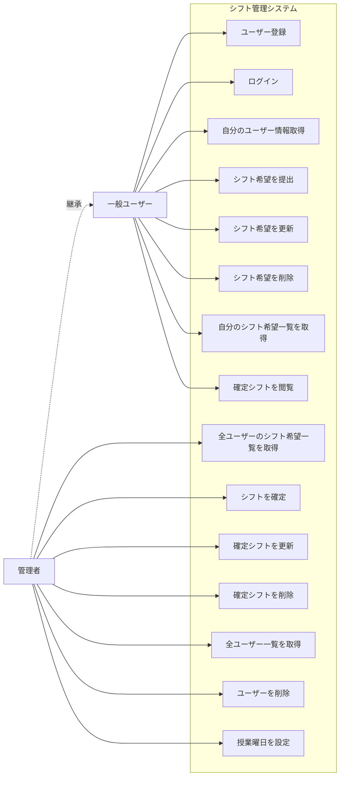
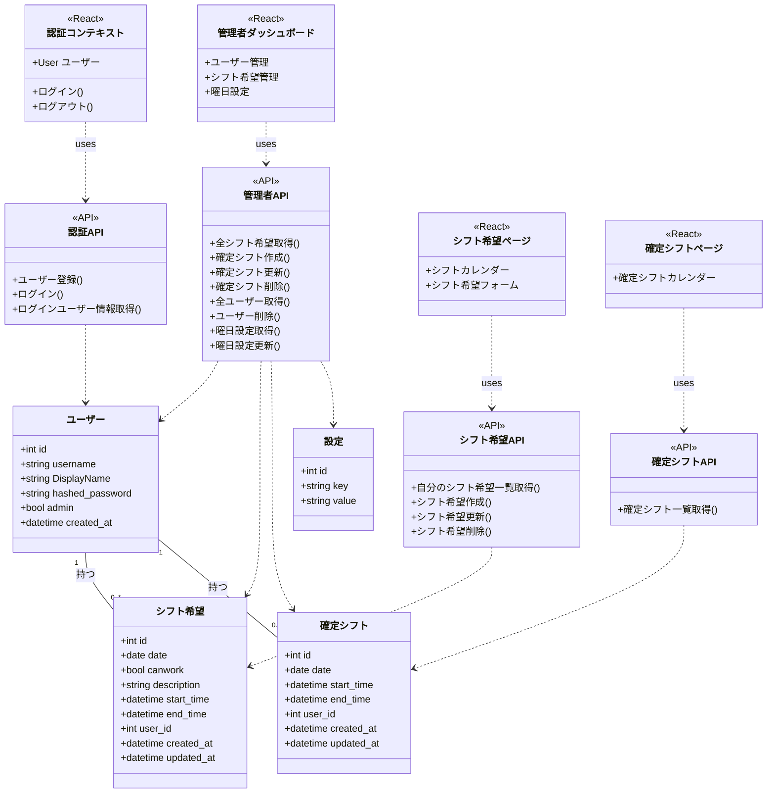

# ユースケース図 (Mermaid)

```mermaid
graph LR
  管理者["管理者"] 
  一般ユーザー["一般ユーザー"]

  subgraph "シフト管理システム"
    direction LR
    UC1["ユーザー登録"]
    UC2["ログイン"]
    UC3["自分のユーザー情報取得"]
    UC4["シフト希望を提出"]
    UC5["シフト希望を更新"]
    UC6["シフト希望を削除"]
    UC7["自分のシフト希望一覧を取得"]
    UC8["確定シフトを閲覧"]
    UC9["全ユーザーのシフト希望一覧を取得"]
    UC10["シフトを確定"]
    UC11["確定シフトを更新"]
    UC12["確定シフトを削除"]
    UC13["全ユーザー一覧を取得"]
    UC14["ユーザーを削除"]
    UC15["授業曜日を設定"]
  end

  %% 継承関係
  管理者 -.->|"継承"| 一般ユーザー

  %% 一般ユーザーの操作
  一般ユーザー --> UC1
  一般ユーザー --> UC2
  一般ユーザー --> UC3
  一般ユーザー --> UC4
  一般ユーザー --> UC5
  一般ユーザー --> UC6
  一般ユーザー --> UC7
  一般ユーザー --> UC8

  %% 管理者の操作
  管理者 --> UC9
  管理者 --> UC10
  管理者 --> UC11
  管理者 --> UC12
  管理者 --> UC13
  管理者 --> UC14
  管理者 --> UC15
```

# クラス図 (Mermaid)

```mermaid
classDiagram
  class ユーザー {
    +int id
    +string username
    +string DisplayName
    +string hashed_password
    +bool admin
    +datetime created_at
  }

  class シフト希望 {
    +int id
    +date date
    +bool canwork
    +string description
    +datetime start_time
    +datetime end_time
    +int user_id
    +datetime created_at
    +datetime updated_at
  }

  class 確定シフト {
    +int id
    +date date
    +datetime start_time
    +datetime end_time
    +int user_id
    +datetime created_at
    +datetime updated_at
  }

  class 設定 {
    +int id
    +string key
    +string value
  }

  ユーザー "1" -- "0..*" シフト希望 : 持つ
  ユーザー "1" -- "0..*" 確定シフト : 持つ

  class 認証API {
    <<API>>
    +ユーザー登録()
    +ログイン()
    +ログインユーザー情報取得()
  }

  class シフト希望API {
    <<API>>
    +自分のシフト希望一覧取得()
    +シフト希望作成()
    +シフト希望更新()
    +シフト希望削除()
  }

  class 確定シフトAPI {
    <<API>>
    +確定シフト一覧取得()
  }

  class 管理者API {
    <<API>>
    +全シフト希望取得()
    +確定シフト作成()
    +確定シフト更新()
    +確定シフト削除()
    +全ユーザー取得()
    +ユーザー削除()
    +曜日設定取得()
    +曜日設定更新()
  }

  class 認証コンテキスト {
    <<React>>
    +User ユーザー
    +ログイン()
    +ログアウト()
  }
  class シフト希望ページ {
    <<React>>
    +シフトカレンダー
    +シフト希望フォーム
  }
  class 確定シフトページ {
    <<React>>
    +確定シフトカレンダー
  }
  class 管理者ダッシュボード {
    <<React>>
    +ユーザー管理
    +シフト希望管理
    +曜日設定
  }

  認証API ..> ユーザー
  シフト希望API ..> シフト希望
  確定シフトAPI ..> 確定シフト
  管理者API ..> ユーザー
  管理者API ..> シフト希望
  管理者API ..> 確定シフト
  管理者API ..> 設定

  認証コンテキスト ..> 認証API : uses
  シフト希望ページ ..> シフト希望API : uses
  確定シフトページ ..> 確定シフトAPI : uses
  管理者ダッシュボード ..> 管理者API : uses
```
