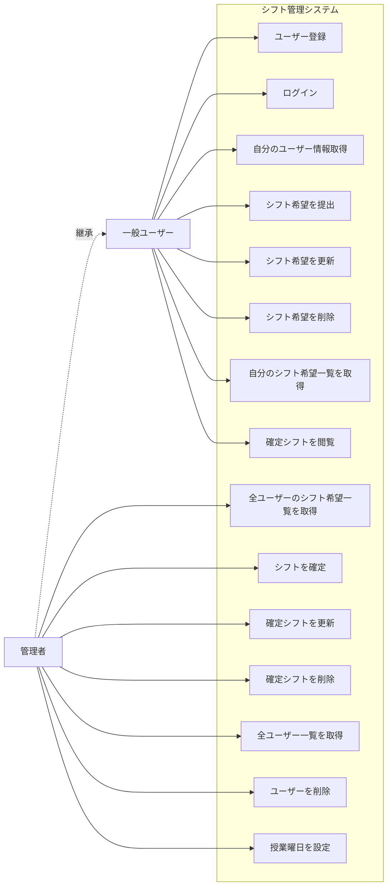
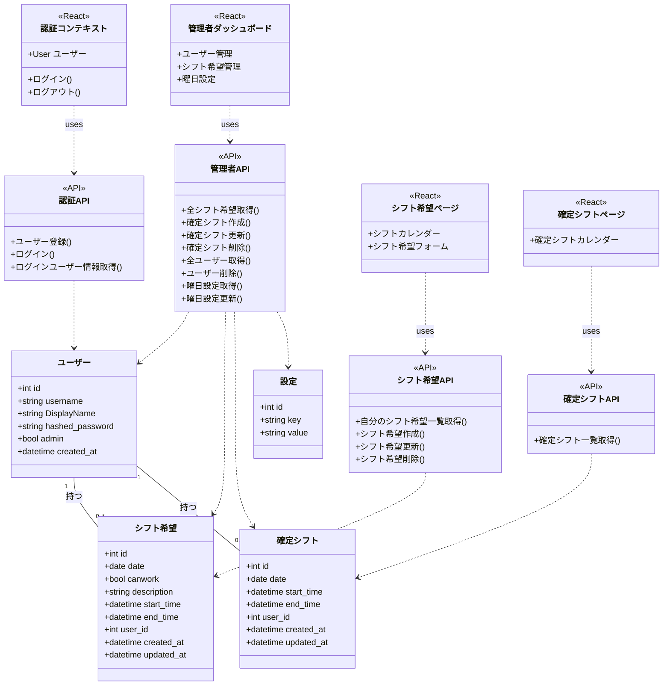
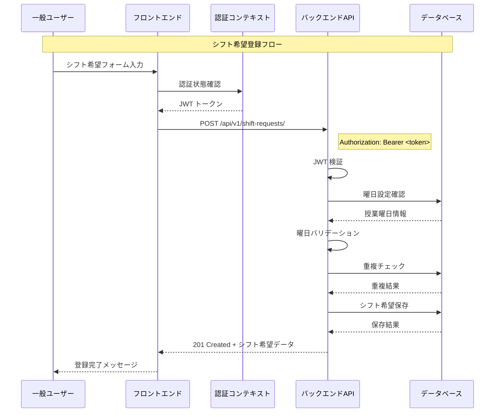
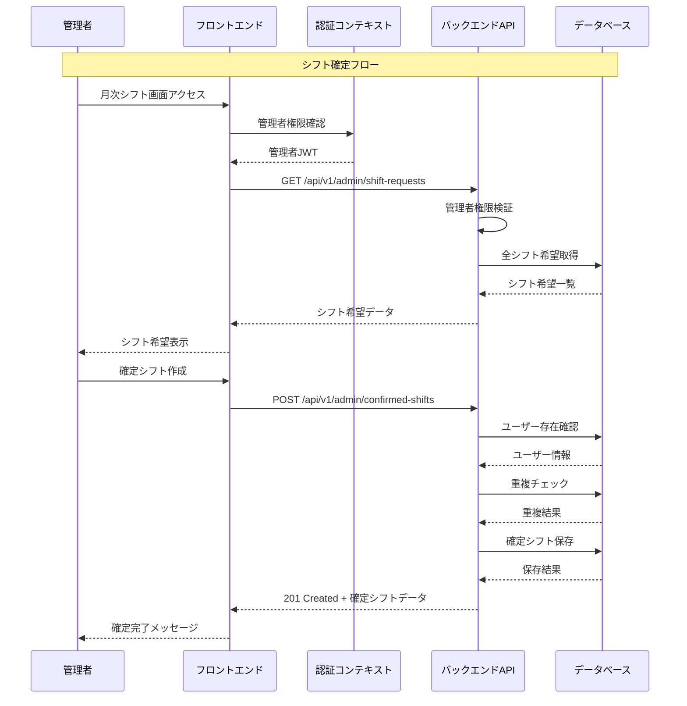
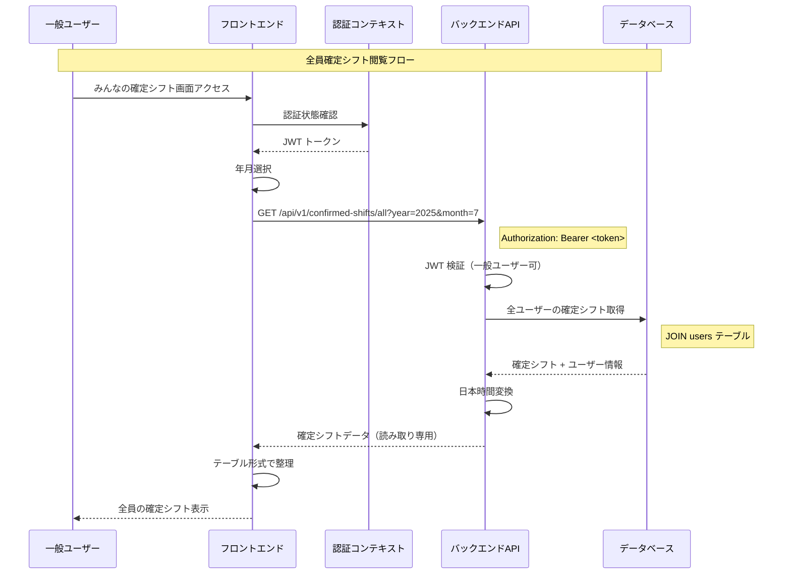
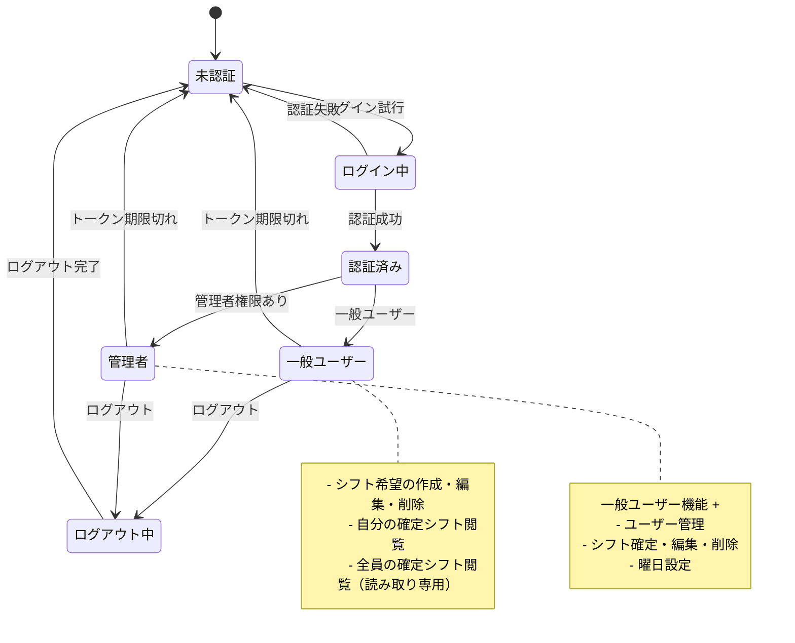
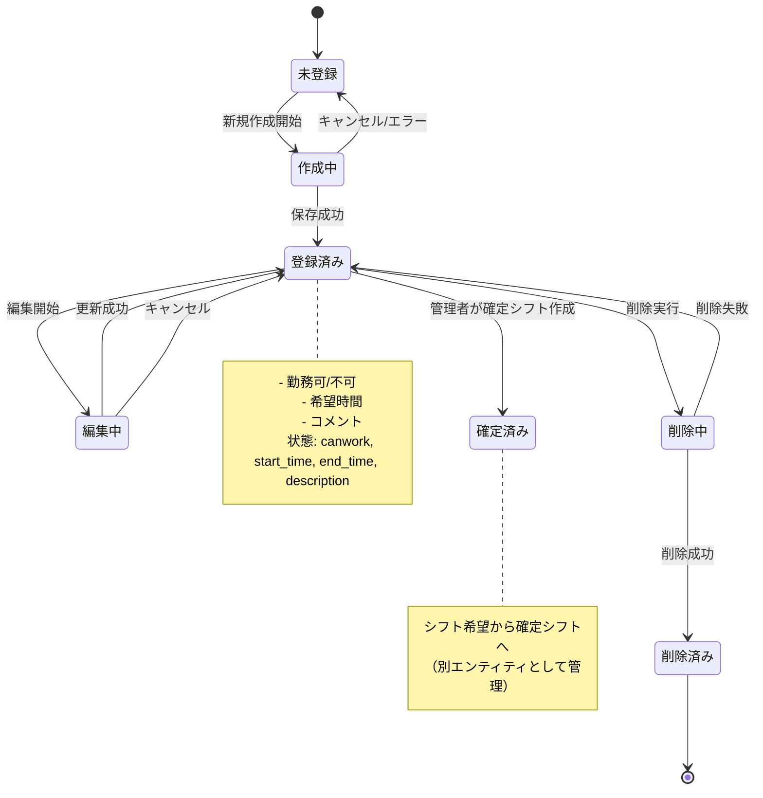
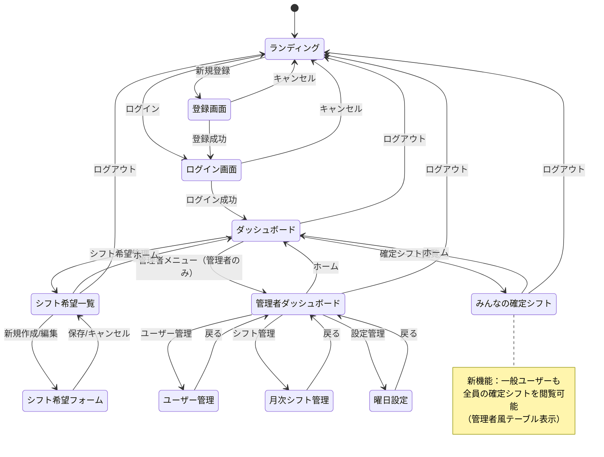

# ユースケース図 (Mermaid)

# クラス図 (Mermaid)

# 協調図 (Mermaid)

## シフト希望登録の協調図

## 管理者によるシフト確定の協調図

## 一般ユーザーによる全員確定シフト閲覧の協調図

# 状態遷移図 (Mermaid)

## ユーザー認証状態の遷移図

## シフト希望の状態遷移図

## アプリケーション画面遷移の状態図

